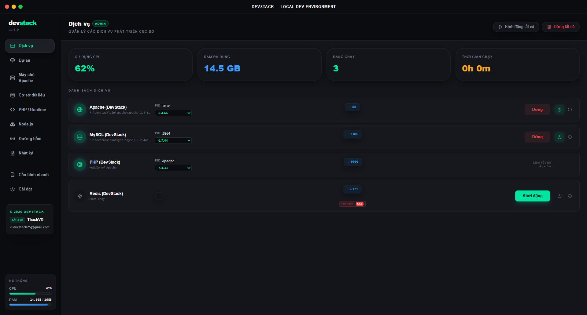
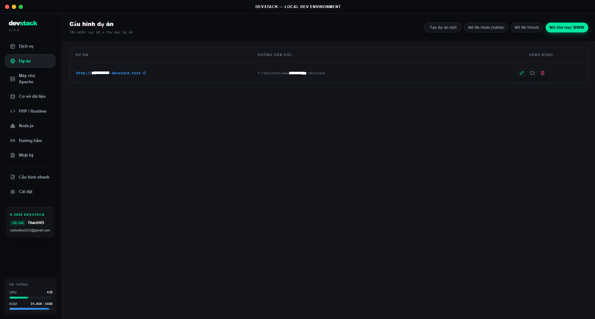
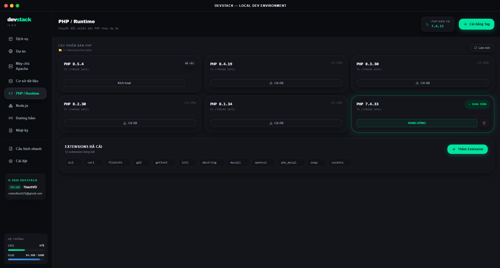
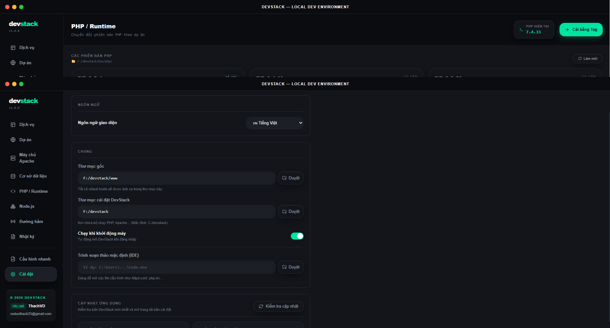

# DevStack

<p align="center">
  
</p>

<p align="center">
  Desktop local development environment for Windows, built with Tauri v2 + React.
</p>

<p align="center">
  <a href="https://holdon1996.github.io/dev-stack/">
    
  </a>
  <a href="https://github.com/holdon1996/dev-stack/releases/latest">
    
  </a>
  <a href="https://github.com/holdon1996/dev-stack#quick-start">
    
  </a>
  <a href="https://github.com/holdon1996/dev-stack/releases">
    
  </a>
</p>

<p align="center">
  <a href="https://github.com/holdon1996/dev-stack/releases">
    
  </a>
  <a href="https://github.com/holdon1996/dev-stack/actions/workflows/release.yml">
    
  </a>
  <a href="https://github.com/holdon1996/dev-stack/stargazers">
    
  </a>
  <a href="https://github.com/holdon1996/dev-stack/network/members">
    
  </a>
  <a href="https://github.com/holdon1996/dev-stack/issues">
    
  </a>
</p>

## Overview

DevStack is a desktop tool for managing a local PHP / Apache / MySQL development stack on Windows with a fast native Rust backend.

Live project page: https://holdon1996.github.io/dev-stack/

It is built for developers who want a local stack manager without juggling multiple tools, shell scripts, or a full VM / container setup.

It focuses on:

- managing Apache, MySQL, PHP, Redis, and project services in one UI
- switching installed runtime versions without a heavy VM or container workflow
- handling virtual hosts, local sites, ports, logs, and quick config from one app
- shipping as a native Windows desktop app with tray support and auto-update support

## What You Can Do

- Start, stop, and monitor local services from one place
- Switch PHP and Apache versions for different projects
- Manage MySQL instances and run quick queries
- Create and manage local sites and virtual hosts
- Review Apache, MySQL, PHP, and Redis logs in the app
- Configure startup behavior, ports, paths, editor, and updates
- Keep the app updated through packaged releases

## Main Sections

- `Services`: start, stop, monitor, and auto-start managed services
- `Sites`: create and manage local virtual hosts and project folders
- `Apache`: install and switch Apache builds
- `Database`: manage MySQL versions and run quick queries
- `PHP`: install, switch, and patch PHP runtimes
- `Tunnels`: expose local services through supported tunnel providers
- `Quick Config`: shortcut actions for common setup tasks
- `Settings`: paths, ports, startup behavior, editor, and updates

## Quick Start

- Download the latest packaged build from [Releases](https://github.com/holdon1996/dev-stack/releases/latest)
- Run the `.exe` or `.msi` installer
- Launch DevStack
- Open `Settings` and configure your paths, ports, and local services

## Screenshots

<p align="center">
  <a href="https://raw.githubusercontent.com/holdon1996/dev-stack/main/docs/screenshots/services.png">
    
  </a>
  <a href="https://raw.githubusercontent.com/holdon1996/dev-stack/main/docs/screenshots/sites.png">
    
  </a>
</p>

<p align="center">
  <a href="https://raw.githubusercontent.com/holdon1996/dev-stack/main/docs/screenshots/php.png">
    
  </a>
  <a href="https://raw.githubusercontent.com/holdon1996/dev-stack/main/docs/screenshots/settings.png">
    
  </a>
</p>

- `Services`: manage running services, ports, versions, and quick actions
- `Sites`: create and manage local domains and project folders
- `PHP`: switch runtimes and inspect installed versions
- `Settings`: configure paths, startup behavior, ports, and updates

## Who This README Is For

- If you only want to install and use DevStack, the sections above are enough
- If you want to build, debug, or release the app, see the development notes below

<details>
<summary><strong>Development Notes</strong></summary>

## Development

### Prerequisites

- Node.js 20+
- Rust stable
- Windows

### Run In Development

```powershell
npm install
npm run tauri dev
```

### Build A Release

```powershell
npm run tauri build
```

### Tech Stack

- Tauri v2
- React 19
- Zustand
- Tailwind CSS
- Rust

### Project Structure

```text
src/                 React UI, state slices, hooks
src-tauri/           Rust commands, Tauri config, bundling
src/store/           Zustand slices for app domains
scripts/             Local helper scripts for release and versioning
.github/workflows/   Release automation
```

### Release And Auto Update Notes

Release signing and updater flow are already wired into the app.

- Release workflow: [.github/workflows/release.yml](/f:/dev-stack/.github/workflows/release.yml)
- Local updater env helper: [scripts/set-updater-env.ps1](/f:/dev-stack/scripts/set-updater-env.ps1)

If this repository is private, GitHub-hosted updater assets will not be publicly downloadable by end users. With the current updater URL strategy, the repository should stay public or use a separate update endpoint.

### Recommended Setup

- VS Code
- Tauri extension
- rust-analyzer

</details>

## Star History

<p align="center">
  <a href="https://star-history.com/#holdon1996/dev-stack&Date">
    
  </a>
</p>

## Support

- Report bugs or request features: https://github.com/holdon1996/dev-stack/issues
- Download packaged builds: https://github.com/holdon1996/dev-stack/releases

### Donate

If DevStack is useful in your workflow, you can support the project here:

<p align="center">
  
</p>
