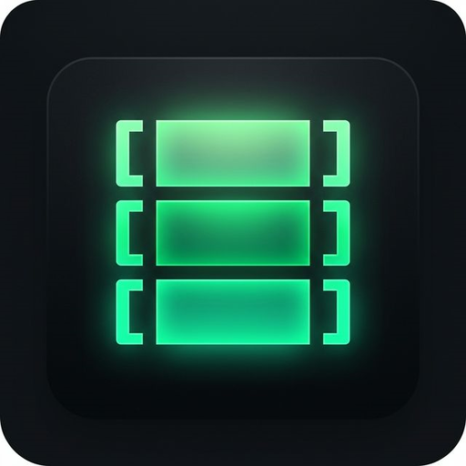

# DevStack

<p align="center">
  
</p>

<p align="center">
  Desktop local development environment for Windows, built with Tauri v2 + React.
</p>

<p align="center">
  <a href="https://github.com/holdon1996/dev-stack/releases/latest">
    
  </a>
  <a href="https://github.com/holdon1996/dev-stack#quick-start">
    
  </a>
  <a href="https://github.com/holdon1996/dev-stack/releases">
    
  </a>
</p>

<p align="center">
  <a href="https://github.com/holdon1996/dev-stack/releases">
    
  </a>
  <a href="https://github.com/holdon1996/dev-stack/actions/workflows/release.yml">
    
  </a>
  <a href="https://github.com/holdon1996/dev-stack/stargazers">
    
  </a>
  <a href="https://github.com/holdon1996/dev-stack/network/members">
    
  </a>
  <a href="https://github.com/holdon1996/dev-stack/issues">
    
  </a>
</p>

## Overview

DevStack is a desktop tool for managing a local PHP / Apache / MySQL development stack on Windows with a fast native Rust backend.

It focuses on:

- managing Apache, MySQL, PHP, Redis, and project services in one UI
- switching installed runtime versions without a heavy VM or container workflow
- handling virtual hosts, local sites, ports, logs, and quick config from one app
- shipping as a native Windows desktop app with tray support and auto-update support

## Highlights

- Native Tauri v2 desktop app
- React + Zustand frontend
- Rust backend for process management, file operations, downloads, and system integration
- Apache version management
- PHP version management and per-project switching
- MySQL management and query execution
- Virtual host setup with hosts file sync
- Tunnel integrations page
- Log viewer for Apache, MySQL, PHP, and Redis
- Start with Windows support
- Native updater support for packaged releases

## Main Sections

- `Services`: start, stop, monitor, and auto-start managed services
- `Sites`: create and manage local virtual hosts and project folders
- `Apache`: install and switch Apache builds
- `Database`: manage MySQL versions and run quick queries
- `PHP`: install, switch, and patch PHP runtimes
- `Tunnels`: expose local services through supported tunnel providers
- `Quick Config`: shortcut actions for common setup tasks
- `Settings`: paths, ports, startup behavior, editor, and updates

## Tech Stack

- Tauri v2
- React 19
- Zustand
- Tailwind CSS
- Rust

## Project Structure

```text
src/                 React UI, state slices, hooks
src-tauri/           Rust commands, Tauri config, bundling
src/store/           Zustand slices for app domains
scripts/             Local helper scripts
.github/workflows/   Release automation
```

## Quick Start

Want to install DevStack quickly?

- Download the latest packaged build from [Releases](https://github.com/holdon1996/dev-stack/releases/latest)
- Run the `.exe` or `.msi` installer
- Open DevStack and configure your paths, ports, and local services in `Settings`

### Prerequisites

- Node.js 20+
- Rust stable
- Windows

### Development

```powershell
npm install
npm run tauri dev
```

### Production Build

```powershell
npm run tauri build
```

## Releases And Auto Update

Updater and release signing are already wired into the app and workflow.

- Release workflow: [.github/workflows/release.yml](/f:/dev-stack/.github/workflows/release.yml)
- Local env helper: [scripts/set-updater-env.ps1](/f:/dev-stack/scripts/set-updater-env.ps1)

If the repository is private, GitHub-hosted updater assets will not be publicly downloadable by end users. For the current updater URL strategy, the repository should be public or served through a separate update endpoint.

## Recommended Setup

- VS Code
- Tauri extension
- rust-analyzer

## Roadmap

- Better release presentation and screenshots
- More automated runtime discovery
- Improved SSL and local certificate flow
- Better onboarding for first-time setup

## Star History

<p align="center">
  <a href="https://star-history.com/#holdon1996/dev-stack&Date">
    
  </a>
</p>

## Support

- Issues: https://github.com/holdon1996/dev-stack/issues
- Releases: https://github.com/holdon1996/dev-stack/releases
